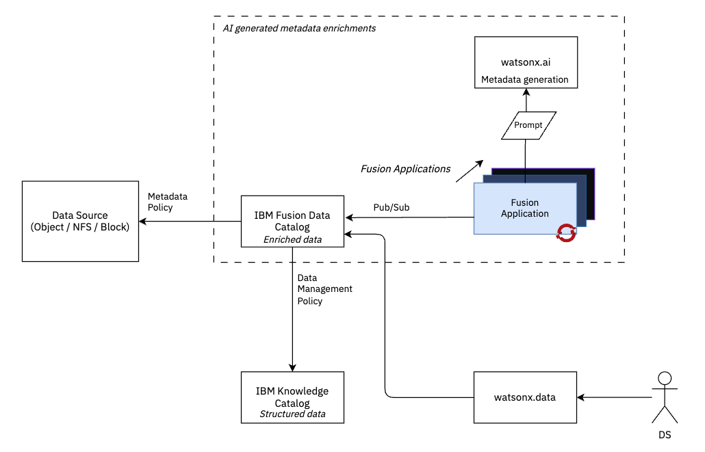

## Fusion Data Catalog watsonx.ai Generated Metadata

Generative AI has high utility for generating metadata for both structured and unstructured data and is relevant in the storage domain where data discoverability drives the value of data across the enterprise including for downstream AI projects.

This repository demonstrates how to extend IBM Fusion with the Fusion SDK to create a IBM Fusion Application that utilises AI to generate metadata. We create a metadata policy in IBM Fusion to filter images with missing metadata tags and publish the image reference to a Kafka topic for the IBM Fusion Application to consume. We use the watson machine learning SDK (watsonx.ai API) with a basic prompt to generate metadata tags associated with the image that catalogued in IBM Fusion. We also integrate IBM Knowledge Catalog for enterprise wide data cataloging and watsonx.data for querying and to enable downstream AI building.

We deployed the IBM Fusion Application to OpenShift for a highly scalable, high-throughput data pipeline.

### System View




### Quick-Start

Run the Fusion Application locally with endpoints to IBM Fusion and watsonx.ai.

ENV Vars

```sh
export SPECTRUM_DISCOVER_HOST=
export APPLICATION_NAME=FIRST_APP
export APPLICATION_USER=appuser
export APPLICATION_USER_PASSWORD=

#IBM Cloud API Key for watsonx.ai
export IBM_API_KEY=
# watsonx.ai project ID
export PROJECT_ID=
# Watson Machine Learning base URL
export WX_BASE_URL=https://eu-gb.ml.cloud.ibm.com
```

Create and activate a virtual environment using venv type:

```bash
python -m venv venv
source venv/bin/activate
```

Installing project requirements

```bash
pip install -r requirements.txt --no-dependencies
```

Dockerfile & K8 deployment files have been included. 

### Troubleshooting Setup

Fix for ibm-spectrum-discover-application-sdk pip import not working: 

> Please be warned, this command may take a while to complete. M1 Macbook Pro took ~20 minutes. 

```bash
brew install librdkafka
```

And rerun the pip install -r requirements. 

```
LIBRARY_PATH=/opt/homebrew/Cellar/librdkafka/2.6.1/lib C_INCLUDE_PATH=/opt/homebrew/Cellar/librdkafka/2.6.1/include/ pip install -r requirements.txt
```

### Configuring Spectrum Discover

In order to connect the application to Spectrum Discover, first run the application with `python ExampleApplication.py`, making sure the venv is activated. The application should then show up under the applications section which you can access from the hamburger menu at the top left. 

Next we need to create a new tag which our application will fill in. We can do this from the tag management section, where we should create a new tag called `watsonx_description` and make it the Open type, meaning that the application can fill in any value into the field. 

After this, from the same Tag management section, navigate to policies and add a new policy. The name can be set to anything, and the policy type should be `DEEP-INSPECT`. Press next, and select the collections you want the application to process. The filter should be set to a the value which selects the records you want to index, such as `cluster IN ('s3.eu-gb.cloud-object-storage.appdomain.cloud')`. The value for the filter can be found by using the query builder to find a query which selects the records which need processing. For the application, you should select the name from the app which you ran earlier, by default `FIRST_APP`. For the parameters set `extract_tags` to the `watsonx_description`. On the schedule section, leave it as inactive, it can still be run manually. Review the policy and then save it.

From the list of policies in tag management, select your policy and then start. The Python application will then receive the files to process through Kafka and submit the images to watsonx.ai for processing. 

## References 

https://github.com/IBM/Spectrum_Discover_Example_Application/blob/master/ExampleApplication.py

